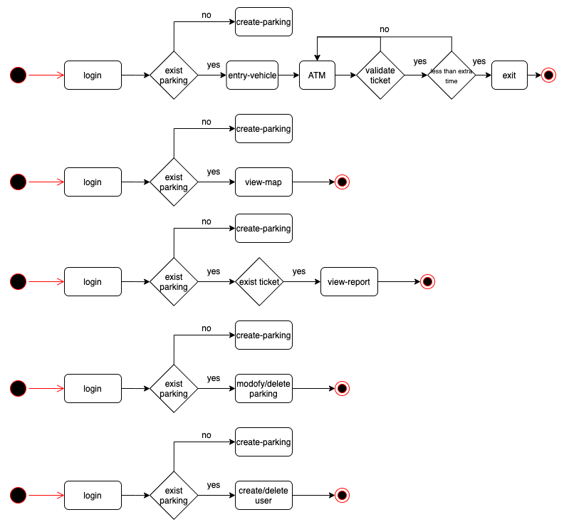
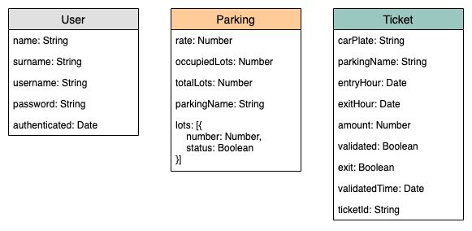

# StayCar

StayCar is a parking access control system. With StayCar you can monitor the status of your parking, wich lots are occipied or free and check in real time wich tickets are validated.
Also, you can establish and update the price rate and the number of lots.

## Functional Description

The first thing that user should do after login is create the parking, after this the user can:

<ul>
    <li>Update Parking</li>
    <li>Delete Parking</li>
    <li>Create new User</li>
    <li>View Report</li>
    <li>View parking Map</li>
    <li>Entry Vehicle</li>
    <li>Validate Ticket</li>
    <li>Exit Vehicle</li>
</ul>

### Use Cases
 

### Flow

## Technical Description

### Blocks

### Data Model

### API code coverage

### Trello

[StayCar-Trello](https://trello.com/b/aFEhLGuM)