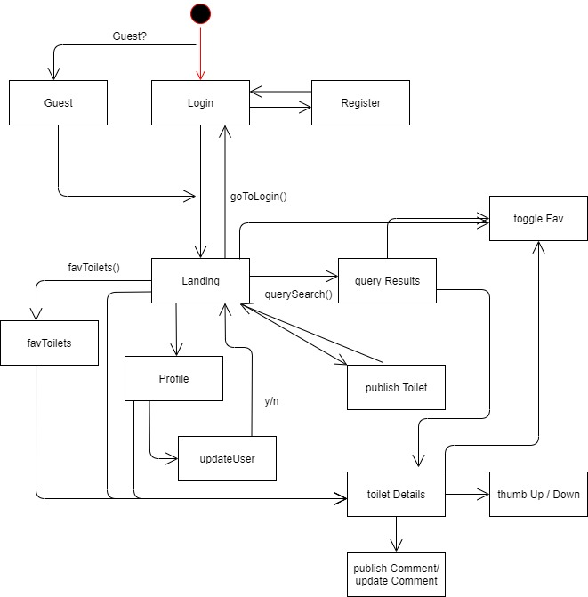
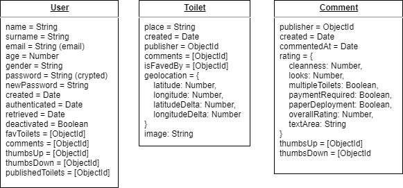
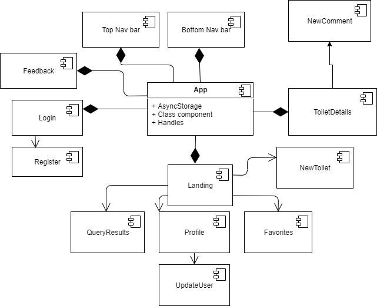
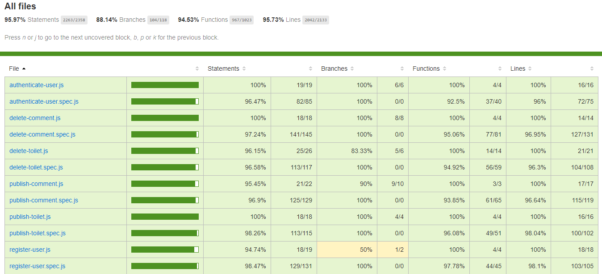
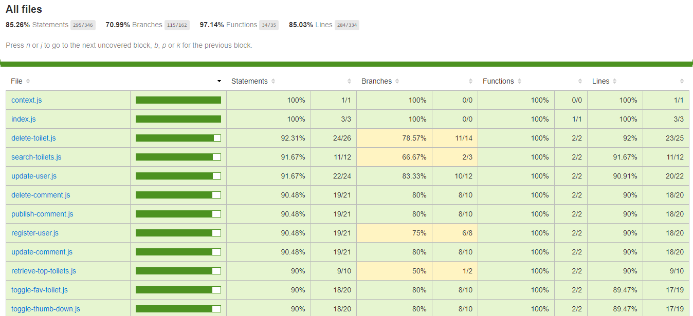

# 💩 Poopinion App 💩

## 🚽 Description 🚽
Poopinion is a mobile-oriented app purposed on rating toilets on public spaces, such as restaurants, events or companies. The aim for this project is to increase the average quality of those places and keep then clean, hygienic and pretty. Toilet necessities are evident and society needs better ways to know the quality of toilets they might be end up using.

The application is inspired by other rating apps such as TripAdvisor, where you can evaluate several features and give an overall score. The main difference is that Poopinator will allow registered users to post themselves, rather than check for company posts and rate them. This decision is done so the rating of toilets if full community-oriented.

## 🚽 Functional description 🚽
- User registering and login, as well as Guest entry
- Geolocation-oriented landing page, with the Top toilets to display
- Add a new Toilet post, with images and ratings
- Rate other users' toilet posts, and contribute to their overall rating
- Add comments to a post, giving further or personal experience
- Rate comments from other users
- Use a query system to find the toilet from a certain place you want to go
- Add toilets to favorites and check them later
- User interface

### Use cases

## 🚽 Technical description 🚽

### Flowchart

### Data model

### Components

## 🚽 Code coverage 🚽

### Server-side

### Client-side

