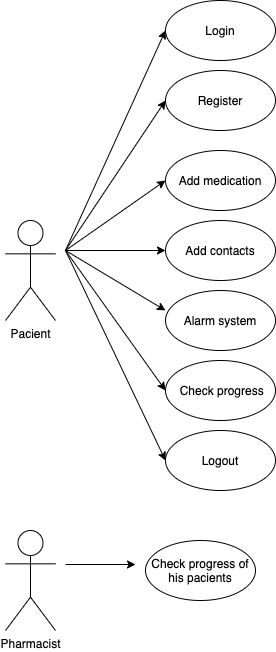
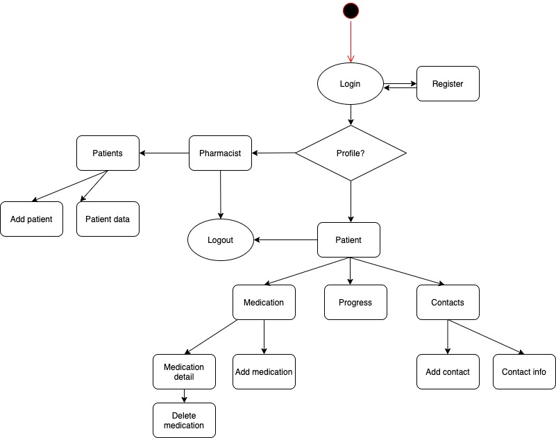
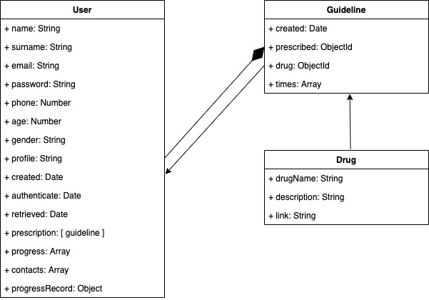
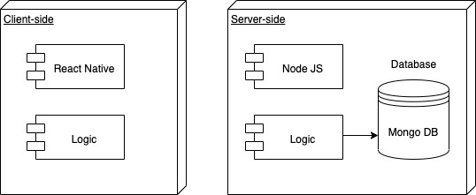
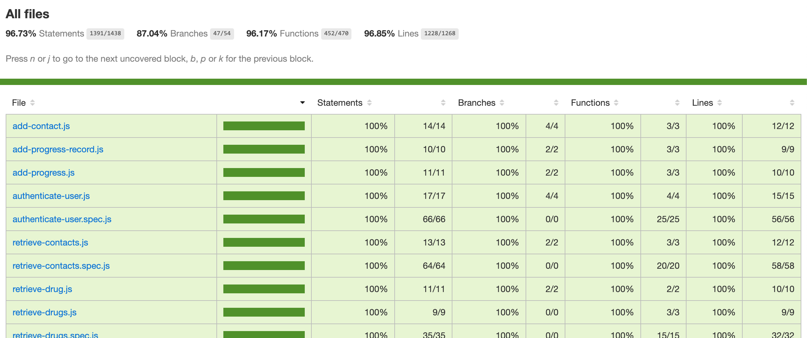
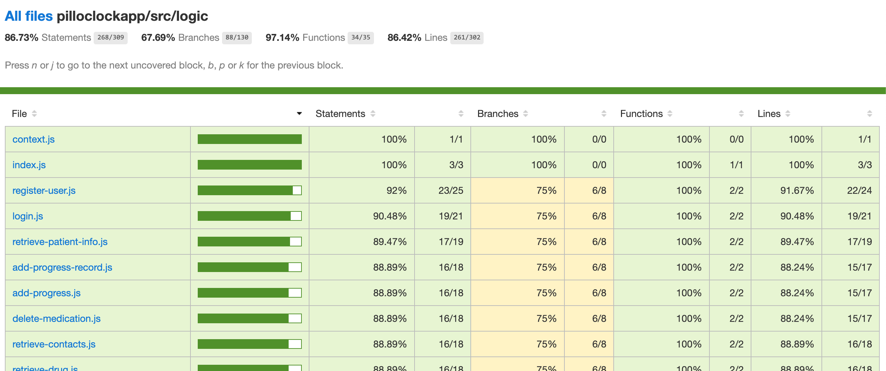

# ⏰💊 Pill O'Clock 💊⏰
Pill O'Clock is a medication reminder mobile app that will display an alarm system. Also you can check your progress in a calendar based in checks. If you take your medicines correctly in a day you will have a check this day. If you not you will have a cross.

Also have the option to register not only like a patient but pharmacist too. The pharmacist can see the progress of their patients.

# 💊 Functional description 💊
- User register and login
- User can have a patient or pharmacist profile
- Patient or pharmacist landing page
- Patient can add or delete medication with an alarm system attached to it
- Patient can add a pharmacist to their contact list through a qr code
- Patient can check their progress on a calendar sistem
- Patient can see their pharmacist's contact info
- Pharmacist can add or delete a patient to their contact list through a qr code
- Pharmacist can check their patients' contact info and their progress in their calendar
- Logout

## 👩‍⚕️ Use-Cases 👩‍⚕️

# 💊 Technical description 💊
## Flow chart

## Data model

## Blocks

# ⏰Code-coverage ⏰
## Servere-side

## client-side
 

# Trello
[Pill o'clock Trello](https://trello.com/b/fFh8z5rm/pill-o-clock)
