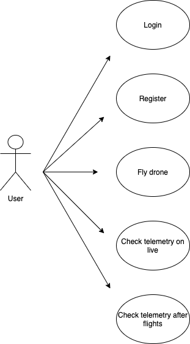

# Js-Drone
 

## Funcional Description

Js-Drome is an application, developed using React Js and Electron Js, that allows you to control a Drone Tello through a Nintendo Switch joycon or keyboard, watch live video and telemetry from the drone, and save telemetry for each flight.

- User registration and login
- Control your drone through a Nintendo Switch Joycon or a keyboard
- See live height chart
- Check live telemetry such as pitch, temperature, atmospheric pressure, speed, acceleration ...
- Save telemetry in your personal profile
- Check the telemetry of each flight in the graphics

## User cases

## Flowcharts

# Tecnical Description

## Blocks

## Data model

## Api coverage

# Futures versions

* DS4 and Xbox controller support
* Gyroscope to control drone
* Save pictures and videos comming from drone
