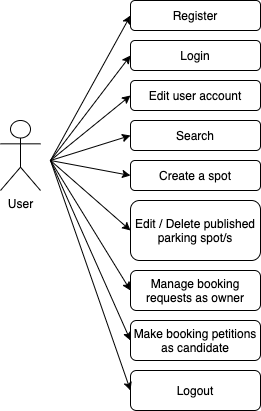
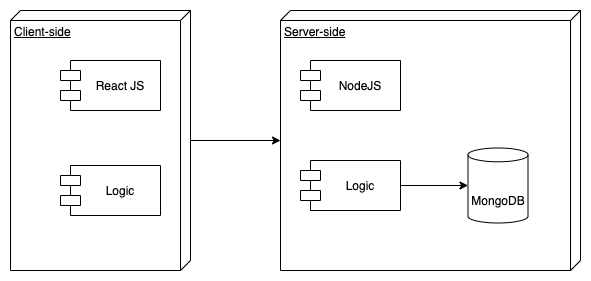

# SHARE MY SPOT APP

## INTRODUCTION
The application allows both owners and not-owners of parking places, to be able to either switch spots with other owner while they're away of their own parkings places, or to simply book an hourly-rated spot in a most convenient and fast way. This occurs in those hours of the day that the parking place is free from its original tenant (either because the owner is at work, having some days off, or just on vacations). The idea is not only to optimize the already overpopulated parking situation of the cities, but also to get evey owner to be able to raise some money in the meantime while taking the most of their own parking spots.

## FUNCTIONAL DESCRIPTION

### Uses Cases

### Flows

- General Flow Chart 

    

- Activity Flows

    
    
    
    
    
    
    

## TECHNICAL DESCRIPTION

### Blocks

### Components

### Classes

### Data Model

### Technologies

Javascript, ReactJS, Node.js, Express, MongoDB, Mongoose, SASS. Testing: Jest & Mocha/Chai