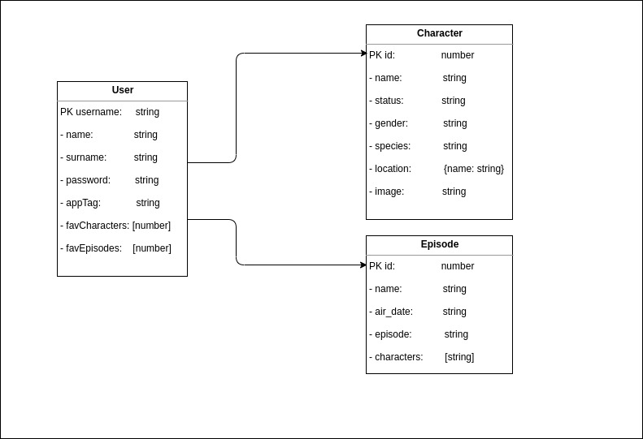

# Rick And Morty App   

## Introduction

Funny app to find crazy characters of the Rick and Morty universe. You can also search for episodes, add and view favorites.

## Functional Description

This app was created with React, no frameworks where used. It is designed to make calls to 2 API's:
    -User API
    -Rick and Morty API

The user API is used to store user data and get it. While the Rick and Morty API is only for getting data.

Using this 2 API's we can create a flow to get data from on and store it in the other, and so molding the data of the user to display the correct info in the view.

### Use Cases

### Activity

## Technical Description

### Blocks

### Components

### Data Model

### Favorites retrieving sequence

