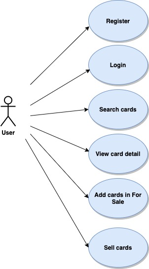

# Magic-the-gathering

# Introduction
Application of search and sale of cards

## Functional description
The registered user can search for filtered cards by name, color, type, rarity or mana cost under selected language. Clicking on the letter shows the details, and user can add it to sale. In for sale section the user can see all the cards on sale, and can contact with the sealer. In profile user for sale section can see on sale units cards, total amount price of cards and can take out from on sale, clicking on sold button. In profile user sold section can see sold cards and total amount of cards.

 