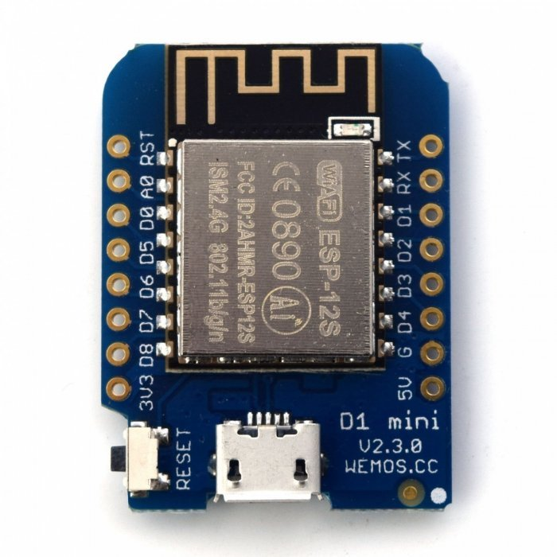
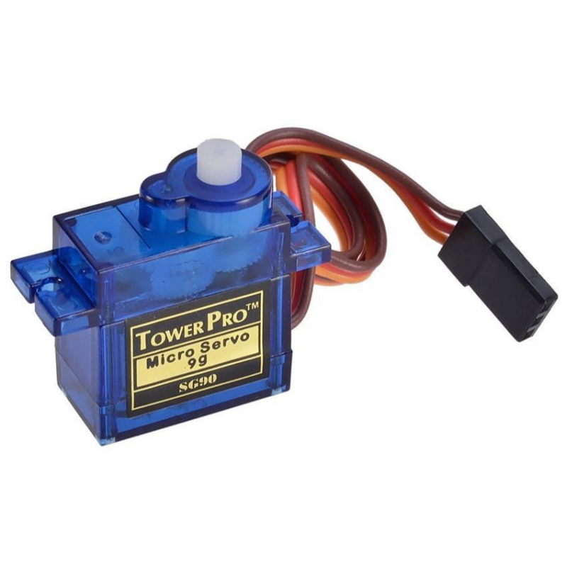
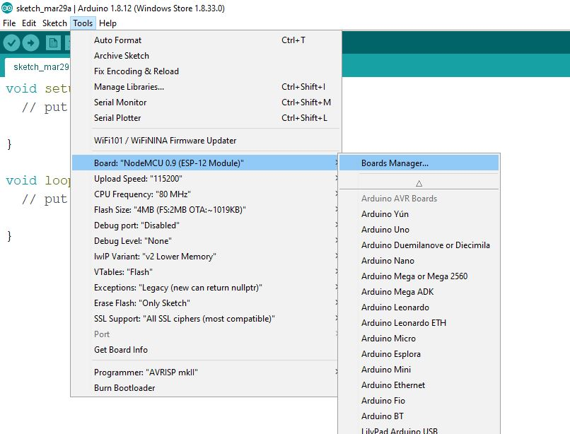
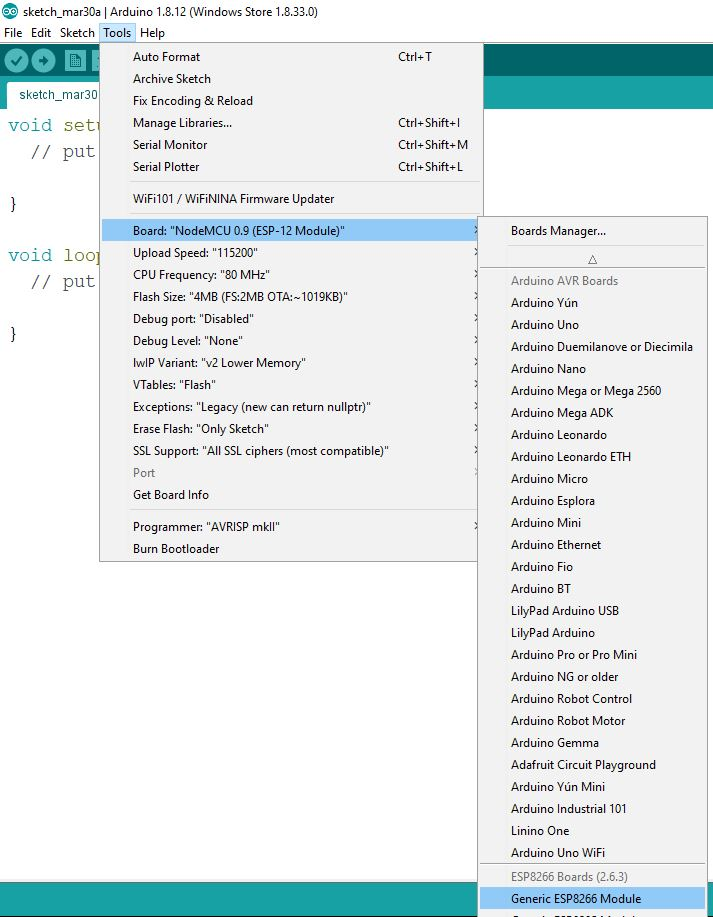
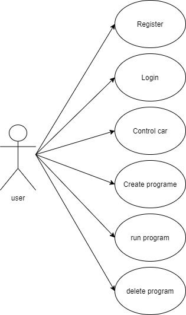
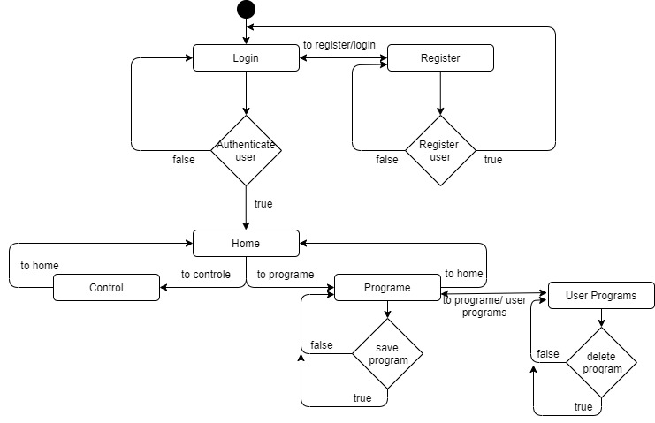
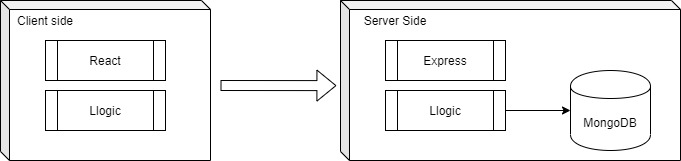
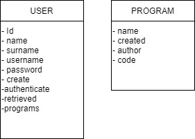
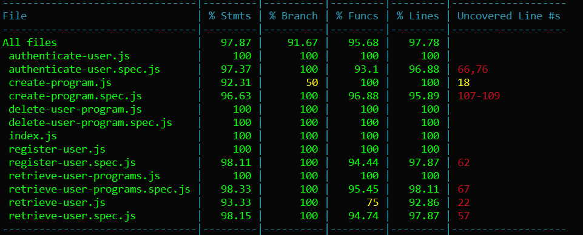

# Karmark

for this project I used a Wemos D1 mini board and two servomotors

To program this board I use [Arduino IDE](https://www.arduino.cc/en/Main/Software) that is based on C and C++. It is used to program Arduino boards but there are also other boards that are compatible with that software.

Anyway we will need to change some configurations to be able to sende the program to the Wemos.

We need to go to Boards Manager and find our board. The Wemos D1 mini is a ESP8266 based board, so we can select this one and install.

Once we did this we are able to select the esp8266 configuration.

With all this done we are ables to download the code to our Wemos D1!

In case We need to flash or update the board firmware we will need to put the next comands.

Before it We will need to download a couple of things.

Fisrt We need to download [Python 2.7 or Python 3.4 or newer](https://www.python.org/downloads/)

To end, if we want to update firmware We need to download the [firmware version](http://micropython.org/download#esp8266)

- sudo easy_install esptool
- esptool.py --port <port_where_board_is_connected> erase_flash
- esptool.py --port <port_where_board_is_connected> --baud 115200 write_flash --flash_size=detect 0 <firmware_version_path>

## Introduccion

Karmark is a programmable electric car. 
It is compounded by one wemos d1 mini and two servo motors. The finality of Karmark is create a toy for the kids and the possibility to make the first contact with the programation on a very simply way.

# Functional Description

## User cases

## Flowcharts

# Tecnocal Description

## Blocks

## Data model

## Api coverage

# Futures versions

* Receive information form car to be able to connect receptors and have a better control of it.
* Be able to configure in your app the ip of your car and the wifi net that you want to connect.
* Make better styles