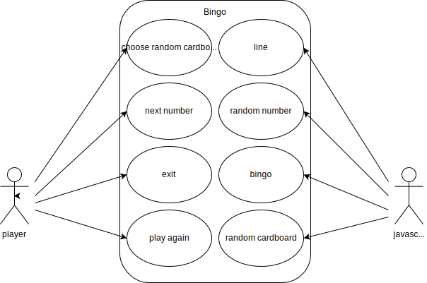
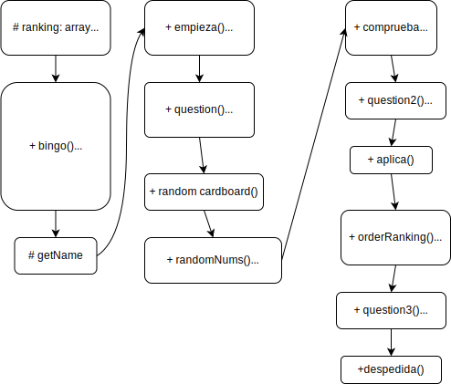

# 5-bingo-js

# Introduction
Bingo with cardboard and random numbers not repeated.
## Functional Description
The player receives a card of random numbers (you can exchange it for another). Each turn, a random number will appear. If a cardboard row is completed, win a line. And if he completes the card, he wins the bingo. Each turn one point will be subtracted from a score of 100 and saved in a ranking. At the end, you will wonder if you want to play again. You can cancel the game by distributing the card and each turn.

### Use Cases

## Technical Description
when executing bingo (), the getName function picks up the player's name. Then a random cardboard is generated. If the player wishes it, it will be generated again until the game begins with the function starts (). The function generates a random number with randomNums () and is recursive if the random number has already been generated or if it has not been possible to reach the index 100. Within it it applies () to the card and checks () if there is a line or bingo. At the end of each check you will ask if you want to continue. If so, when you reach bingo, it generates a ranking.

### Blocks

### Components

### Data Model
