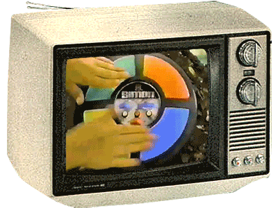
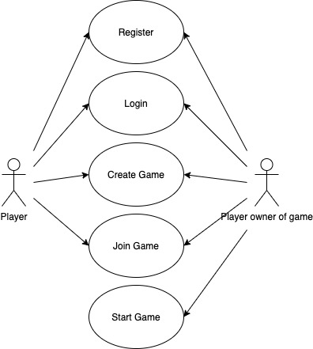
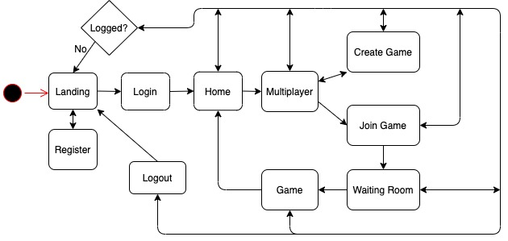
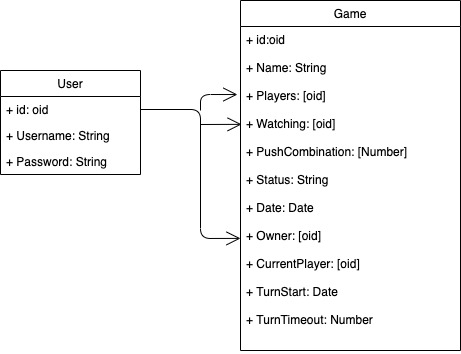

# Simonline
## Introduction
Multiplayer memory game

## Functional description

Simon is an electronic game that was very successful during the 80s. It has a disk shape, on one of its faces you can see four quadrants, each with a color: green, red, blue and yellow in its original version.

The game randomly illuminates the colored quadrants. After waiting, the user must enter the sequence shown in the correct order, using his visual memory. If successful, it will respond with a longer sequence for the next player, and so on. If it fails, the user will wait for the other players to finish until there is only one left

### Use cases

 

## Tecnical description

### Workflow

## Blocks

## Data model
