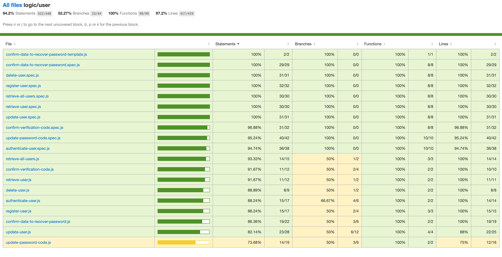

# CrediDay App

## Introduction
Application to manage loans for individuals or companies.

## Functional description
The user can create a company selecting the some plan. Also if the user lost the password, is posibble to recover it throught email. After login the user can see the customer list, add customers, add credits, add payments to the credits and see the reports and get them by mail as well.

### Use cases

## Tecnical description

### Workflow

## Components

## Data Model

## Code coverage

### Server-side

#### Company

#### Credit

#### Payment

#### User

### Client-side
